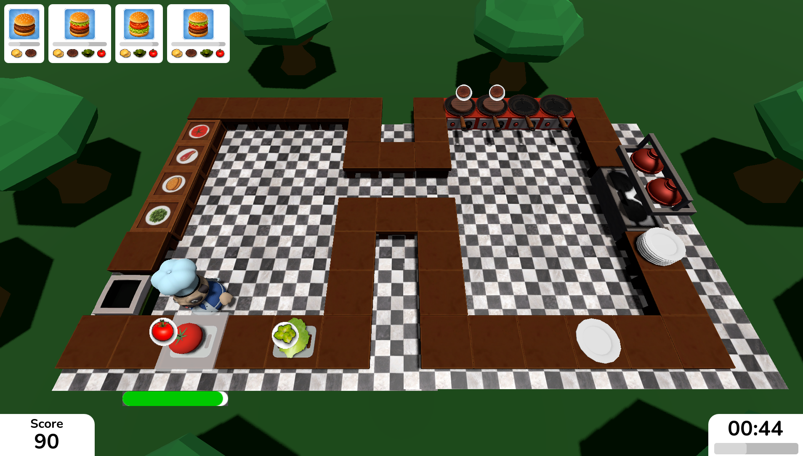
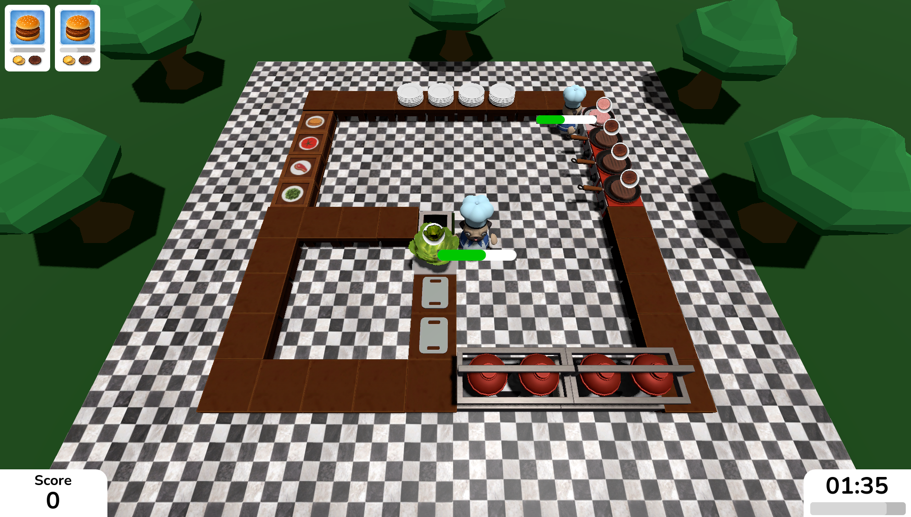
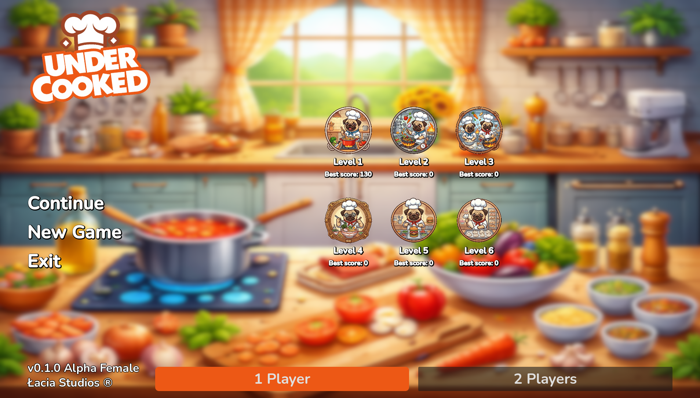

# Dokumentacja gry "Under-Cooked"

## 1. Krótki opis gry
**Under-Cooked** to zręcznościowa gra kooperacyjna, w której gracze wcielają się w kucharzy pracujących w chaotycznej kuchni. Celem gry jest przygotowanie i wydanie jak największej liczby zamówień przed upływem czasu. Gra jest bezpośrednio inspirowana popularnym tytułem *Overcooked!*. Under-Cooked jest mniej intensywną grą w porównaniu do Overcooked, z powodu modyfikacji niektórych mechanik - nie ma możliwości spalenia jedzenia (i całej kuchni) podczas smażenia na patelni, oraz gracze nie dostają ujemnych punktów za nieoddanie potrawy na czas.

## 2. Użyte narzędzia
- **Silnik / Język:** Godot Engine, skrypty napisane w językach GDScript oraz C#.
- **Platforma docelowa:** PC (Windows / macOS / Linux).
- **Dodatkowe narzędzia:** Wykorzystano wtyczkę [Unidot Importer](https://github.com/V-Sekai/unidot_importer) do importowania zasobów z projektów Unity. Część assetów była przerabiana w Blenderze.

## 3. Opis mechaniki gry
- **Opis świata:** Świat gry zrealizowany jest w grafice 3D z rzutem izometrycznym. Poziomy są zamkniętymi, ograniczonymi pomieszczeniami.
- **Kamera:** Kamera jest statyczna, obejmująca całą planszę, aby gracze mieli pełen pogląd na sytuację w kuchni.
- **Postacie:** Gracz steruje kucharzem. Kucharze mogą przenosić przedmioty i wchodzić w interakcje z stacjami roboczymi.
- **Zadania i zagadki:** Głównym wyzwaniem jest optymalizacja ścieżek ruchu między stacjami roboczymi (krojenie, smażenie, wydawanie) przy ograniczonej przestrzeni (np. wąskie przejścia albo duże przestrzenie między stacjami).
- **Taktyka:** Zaleca się ścisły podział obowiązków między graczami (np. jedna osoba tylko kroi, inna smaży), aby uniknąć chaosu i blokowania się w wąskich przejściach.
- **Interfejs użytkownika (UI):** Prosty HUD wyświetlający upływający czas, aktualny wynik punktowy oraz dynamiczną kolejkę nadchodzących zamówień.

## 4. Użyte assety
- **Modele i grafika:** Większość modeli 3D (meble, jedzenie) została importowana z projektu o nazwie Kitchen Chaos i zaimportowana do silnika przy pomocy wtyczki *Unidot Importer*. Modele postaci zostały pobrane z strony sketchfab.com, grafiki 2D w UI i menu głównym zostały wygenerowane przez AI.

## 5. Wykorzystanie AI
Grafiki koncepcyjne i tła w menu głównym zostały wygenerowane przy pomocy dużych modeli językowych ChatGPT i Gemini.

## 6. Uruchomienie gry
### Uruchomienie gotowej gry
Do projektu dołączono gotowy moduł wykonywalny. 
Aby zagrać, wystarczy rozpakować archiwum i uruchomić plik `UnderCooked.exe` (na systemie Windows). Gra nie wymaga instalacji dodatkowych bibliotek.

### Uruchomienie projektu w edytorze Godot
Aby uruchomić projekt w edytorze Godot, należy najpierw skonfigurować wtyczkę `unidot_importer`:
1. Sklonuj lub pobierz repozytorium wtyczki do folderu `addons/unidot_importer` wewnątrz projektu.
2. Włącz wtyczkę Unidot Importer w menu `Projekt -> Ustawienia projektu -> Wtyczki -> Unidot`.

## 7. Screen shots

## 8. Bibliografia
- https://docs.godotengine.org/en/stable/index.html
- https://github.com/HyagoOliveira/KitchenChaos/tree/main/Assets
- https://sketchfab.com/